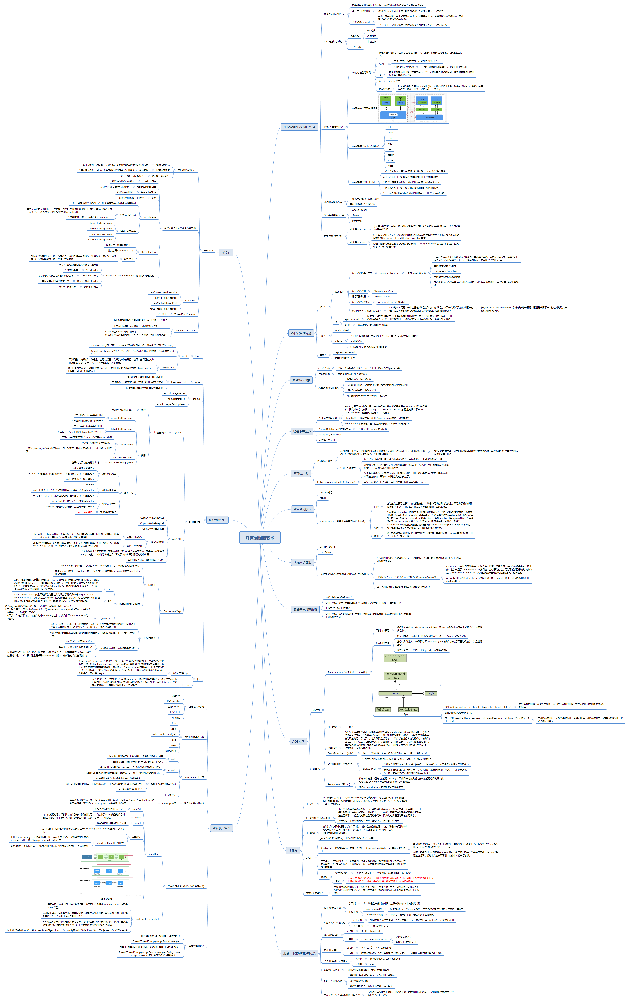

## 简介
concurrent-program 集成管理Java高并发编程案例演示代码，有良好的代码注释，方便学习者阅读学习，看书还不如敲代码，一步一步的执行，深入理解其中的奥妙。
## 项目说明

- 深入学习Java高并发编程，通过此代码将能帮你全面深入的了解Java高并发，以及适用场景，最好自己动手敲一遍。
 
## 项目模块
 - 1.synchronized锁定的是一个对象。
 - 2.synchronized关键字可以修饰代码块，或者方法(静态方法、普通方法)。
 - 3.synchronized锁定类的实例与锁定类的.class文件区别。
 - 4.加synchronized不一定能实现线程安全，具体需要看锁的对象是否唯一。
 - 5.同步方法和非同步方法是可以同时调用的。
 - 6.对业务写方法加锁，同时也要对业务读方法加锁，否则容易产生脏读问题。
 - 7.一个同步方法可以调用另一个同步方法，一个线程已经拥有某个对象的锁，再次申请的时候仍然会得到该对象的锁；也就是说synchronized获得的锁是可重入的。
 - 8.程序在执行过程中，如果出现异常，默认情况锁会被释放。 
 - 9.volatile 关键字，使一个变量在多个线程间可见。 
 - 10.volatile并不能保证多个线程共同修改变量时所带来的不一致问题，也就是说volatile不能替代synchronized。
 - 11.synchronized可以保证可见性和原子性，volatile只能保证可见性。但是volatile的效率要比synchronize高。 
 - 12.解决同样的问题的更高效的方法，使用AtomXXX类，AtomXXX类本身方法都是原子性的，但不能保证多个方法连续调用是原子性。 
 - 13.使用synchronized锁定的代码块尽量少，一般只锁定需要同步的代码块；这样效率才会高。 
 - 14.锁定某对象o，如果o的属性发生改变，不影响锁的使用，但是如果o变成另外一个对象，则锁定的对象发生改变；应该避免将锁定对象的引用变成另外一个对象。 
 - 15.尽量不要以字符串作为锁定的对象，如 string s1="hello" string s2="hello"，当分别用s1和s2作为锁定的对象时，实际它们锁定的是同一把锁。这样很有可能造成死锁。
 - 16.volatile 关键字，是一个变量在多个线程间可见；但是并不能保证原子性。 
 - 17.AtomXXX类本身方法都是原子性的，但不能保证多个方法连续调用是原子性。 
 - 18.synchronize优化，同步代码快中的语句越少越好。 
 - 19.锁定某对象o，如果o的属性发生改变，不影响锁的使用；但是如果o变成另外一个对象，则锁定的对象发生改变；应该避免将锁定对象的引用变成另外一个对象。 
 - 20.reentrantlock用于替代synchronized。
 - 21.ThreadLocal是使用空间换时间，synchronized是使用时间换空间；比如在hibernate中session就存在与ThreadLocal中，避免synchronized的使用。 
 - 22.线程安全的单例模式：使用内部类的写法。 
 - 23.队列Queue的实现类。 
 - 24.线程池中Executors工具类的使用。
 
## 后期更新。。。 

 

 
